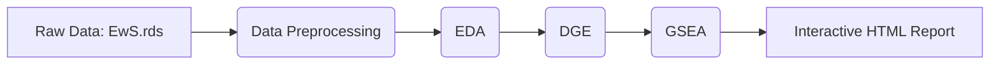

\## Ewing Sarcoma RNA-Seq Analysis


\### Project Overview

This project provides a comprehensive differential gene expression (DGE) analysis of Ewing Sarcoma cell lines. The primary objective is to characterize the transcriptomic shifts occurring upon the knockdown of the EWSR1-FLI1 fusion oncogene (shEF1 condition) compared to control samples (shCTR).


\### Pipeline





\### Methodology

The analysis follows a Tidyverse-compliant workflow and high-standard bioinformatics practices:


\* Data Preprocessing: Standardized Ensembl IDs by removing version suffixes and validated integer count matrices for DESeq2 compatibility.

\* Normalization: Applied Variance Stabilizing Transformation (VST) to ensure homoscedasticity for PCA and heatmaps.

\* DGE Analysis: Modeled gene expression using DESeq2 with a Wald test. Applied apeglm shrinkage to Log2 Fold Change (LFC) estimates to improve reliability for low-count genes.

\* Functional Enrichment: Conducted Gene Set Enrichment Analysis (GSEA) using the clusterProfiler package and KEGG database (via msigdbr) to identify coordinated pathway shifts.


\### Key Biological Insights

\*\*Proliferation Arrest:\*\* Massive downregulation of pathways associated with the cell's replicative machinery (DNA Replication, Ribosome, Spliceosome).


\*\*Phenotypic Reversion:\*\* Upregulation of Focal Adhesion and ECM-receptor interaction pathways, suggesting a shift toward cellular differentiation and restored matrix interaction.


\*\*Genomic Stability:\*\* Identified specific outliers like POLD4 reactivation, which may indicate a shift toward higher DNA replication fidelity after oncogene suppression.


\### Setup \& Reproducibility

To reproduce the analysis, ensure you have the EwS.rds file in your working directory and install dependencies:


```r

install.packages(c("tidyverse", "pheatmap", "DT", "ggpubr"))

BiocManager::install(c("DESeq2", "clusterProfiler", "EnhancedVolcano", "msigdbr", "EnsDb.Hsapiens.v86"))

```


\### Solution Contents

\* \*\*Ewing\_sarcoma.Rmd\*\*: The source RMarkdown file containing code and documentation.

\* \*\*Ewing\_sarcoma.html\*\*: The rendered interactive report.

\* \*\*EwS.rds\*\*: Input transcriptomic data (RangedSummarizedExperiment format).

