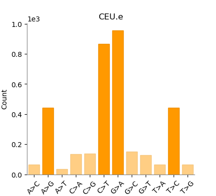

<style>
  body {
    font-size: 20px;
  }
  .main-container .sourceCode.bash {
    display: block !important;
    max-height: none !important;
  }
  .bash-code-folding-btn {
    display: none !important;
  }
</style>

```{r setup, include=FALSE}
knitr::opts_chunk$set(
  echo = TRUE, # show code
  warning = FALSE, # hide warnings
  message = FALSE, # hide messages
  fig.align = "center" # alignment of the figures
)
```


## **Part 1. VCF File Analysis**

**Index a VCF file**

```bash
$ tabix CEU.exon.2010_03.genotypes.vcf.gz

```

### Answers to questions from "Genomic Variant Files"

#### **Q1: How many positions are found in this region (1:1105411-44137860) in the VCF file?**

**A: 69 positions are found:**

```text
$ tabix CEU.exon.2010_03.genotypes.vcf.gz 1:1105411-44137860 | wc -l

# 69
```

#### **Q2: How many samples are included in the VCF file?**

**A: 90 samples are included in the file:**

```text
$ bcftools query -l CEU.exon.2010_03.genotypes.vcf.gz | wc -l
 
#[W::bcf_hdr_check_sanity] AC should be declared as Number=A
# The warning regarding is due to outdated metadata in the VCF header. It does not affect data integrity or the accuracy of the analysis
# 90
```

#### **Q3: How many positions are there total in the VCF file?**

**A: 3489 positions in total**

```text
$ bcftools query -f '%POS\n' CEU.exon.2010_03.genotypes.vcf.gz | wc -l

# [W::bcf_hdr_check_sanity] AC should be declared as Number=A 
# The warning regarding is due to outdated metadata in the VCF header. It does not affect data integrity or the accuracy of the analysis
# 3489
```

#### **Q4: How many positions are there with AC=1? **

**A: 1075 positions with AC=1. Those singletons mean that the mutations are unique (have only 1 allele) and the genetic variance is rather high among samples.**

First explore some data. Here column -t is used for nice output table with first 10 results:

```text
$ bcftools query -f '%CHROM\t%POS\t%REF\t%ALT\t%AC\n' -i 'AC=1' CEU.exon.2010_03.genotypes.vcf.gz | head -n 10 | column -t

# [W::bcf_hdr_check_sanity] AC should be declared as Number=A
# 1  1105411   G  A  1
# 1  1110240   T  A  1
# 1  3541597   C  T  1
# 1  3545211   G  A  1
# 1  7760783   A  G  1
# 1  10424956  A  G  1
# 1  17801259  G  C  1
# 1  17822149  C  T  1
# 1  17886690  C  T  1
# 1  18022150  C  T  1
```
then count the results:

```text
$ bcftools query -f '%CHROM\t%POS\t%REF\t%ALT\n' -i 'AC=1' CEU.exon.2010_03.genotypes.vcf.gz | wc -l

# [W::bcf_hdr_check_sanity] AC should be declared as Number=A
# 1075
```

#### **Q5: What is the ratio of transitions to transversions (ts/tv) in this file?**
**A: 3.47**
```text
$ bcftools stats CEU.exon.2010_03.genotypes.vcf.gz > vcf_report.txt
```


Note: The QUAL field in the statistics report is marked as missing ('.'). This reflects the metadata structure of the VCF file, where quality is reported at the individual genotype level.
Visualization of some metrics (The files - scripts and plots in `vcf_plots` are generated automatically) via this command:

```text
plot-vcfstats -p vcf_plots/ vcf_report.txt
```

The dataset is characterized by a predominance of G>A and C>T substitutions.



## **Part 2: MAF file analysis**

```{r env}
library(maftools)
library(DT)
library(knitr)
```

### **Data summary **

Load the file with low grade glioma (LGG) samples generated as part of The Cancer Genome Atlas Program (TCGA) 

```{r summary calculation, echo=FALSE}
study_data <- tcgaAvailable()
lgg <- tcgaLoad(study = "LGG")
sample_summary <- getSampleSummary(lgg)
gene_summary <- getGeneSummary(lgg)
```
```{r summary 1, echo=FALSE}
datatable(study_data, caption = "Studies available")

```

#### **Q6: What is the median number of variants per sample in this data set?**
```{r summary table2, echo=FALSE}
kable(lgg@summary, caption = "LGG summary")
```
#### **A: 28 (Median of total mutations)**

### **Visualizations **

#### **1. An oncoplot of the top five mutated genes**
```{r}
oncoplot(maf = lgg, top = 5)
```

*NOTE: Variants annotated as Multi_Hit are those genes which are mutated more than once in the same sample.*

**Key findings:**

- Analysis of the most frequent mutations reveals that top 5 are absolute leaders among different samples (86,1%).
- Mutant IDH1 favours the production of 2-hydroxyglutarate, an oncometabolite with multiple downstream effects which promote tumourigenesis. IDH1 mutations have been described in a number of neoplasms most notably low-grade diffuse gliomas, conventional central and periosteal cartilaginous tumours and cytogenetically normal acute myeloid leukaemia
- The antiproliferative role of p53 protein in response to various stresses and during physiological processes such as senescence makes it a primary target for inactivation in cancer. Somatic mutations in the TP53 gene are one of the most frequent alterations in human cancers
- TTN may be a non-driver passenger gene, for it is large enough to accumulate mutations. It was also suggested that later replication time of TTN compared to that of other genes possessing long CDS length increases the mutation frequency as it is correlated with DNA replication timing.

#### **2. A boxplot of the transistion-to-transversion ratio**
```{r}
lgg.titv = titv(maf = lgg, plot = FALSE, useSyn = TRUE)
#plot titv summary
plotTiTv(res = lgg.titv, plotType = "box")
```
**Key findings:**

- The mutation spectrum reveals a predominance of C>T and G>A substitutions. This pattern is consistent with natural biological processes in human genomic data.
- The Ti/Tv ratio analysis shows a significant predominance of transitions over transversions, which is expected 

#### **3. A plot comparing the mutation load in this LGG cohort to other TCGA cohorts**

```{r}
lgg.mutload = tcgaCompare(maf = lgg, cohortName = 'Analysed LGG', logscale = TRUE, capture_size = 50)
```
**Key findings:**

- The Tumor Mutational Burden analysis places the analysed LGG cohort among the lower range of mutation frequencies compared to other cancer types (and close to another LGG cohort). While most LGG samples exhibit a stable genome with low TMB, a subset of patients shows a hypermutated phenotype, indicating significant genomic heterogeneity within this group.

### **References**
- Mayakonda A, Lin DC, Assenov Y, Plass C, Koeffler HP. 2018. Maftools: efficient and comprehensive analysis of somatic variants in cancer. Genome Research. PMID: 30341162
- Ellrott K, Bailey M, Saksena G. Scalable Open Science Approach for Mutation Calling of Tumor Exomes Using Multiple Genomic Pipelines
Cell Systems, 6, 271-281.e7
- Bruce-Brand C, Govender DGene of the month: IDH1 Journal of Clinical Pathology 2020;73:611-615
- Olivier, M., Hollstein, M., & Hainaut, P. (2010). TP53 mutations in human cancers: origins, consequences, and clinical use. Cold Spring Harbor perspectives in biology, 2(1), a001008. https://doi.org/10.1101/cshperspect.a001008
-Oh, JH., Jang, S.J., Kim, J. et al. Spontaneous mutations in the single TTN gene represent high tumor mutation burden. npj Genom. Med. 5, 33 (2020). https://doi.org/10.1038/s41525-019-0107-6